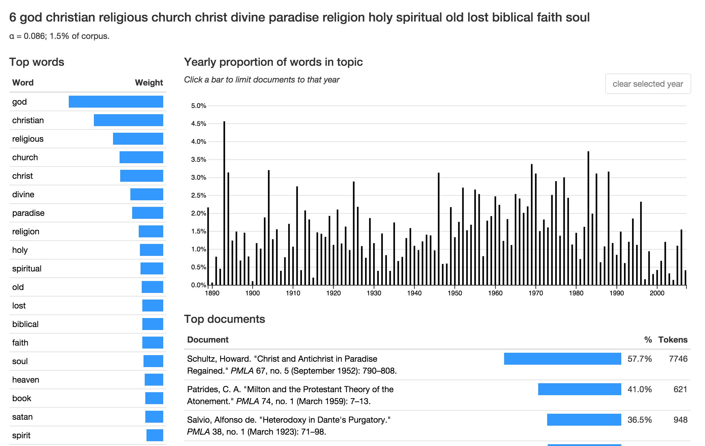

- [Six degrees of francis bacon](http://www.6dfb.org/)
  - 
- [Topics in PMLA](http://agoldst.github.io/dfr-browser/demo/)
  - 
- Interesting Infrastructures
  - [Github](https://github.com/mcburton/)
  - [Jupyter Notebooks](http://jupyter.org)

- [Programming historian](http://programminghistorian.org/)
  
  - 
  
  
  - [TextStats](https://github.com/johnlaudun/textstats)
    - 
  
- [Computational Media](http://www.annettevee.com/2015fall_computationalmedia/)
  
- - [How to make a Twitter bot](https://emerging.commons.gc.cuny.edu/2013/10/making-twitter-bot-python-tutorial/)
  
- Social Media
  
  - 
  
- - [DHNow](http://digitalhumanitiesnow.org/subscribed-feeds/)
    - 
  - [DH Twitter](http://www.martingrandjean.ch/digital-humanities-on-twitter/)
    - 
  
- Questions:
  
  - How have you disseminated your work, especially outside of traditional channels (conference, journal, book)?
  - Anyone have a blog? Twitter?