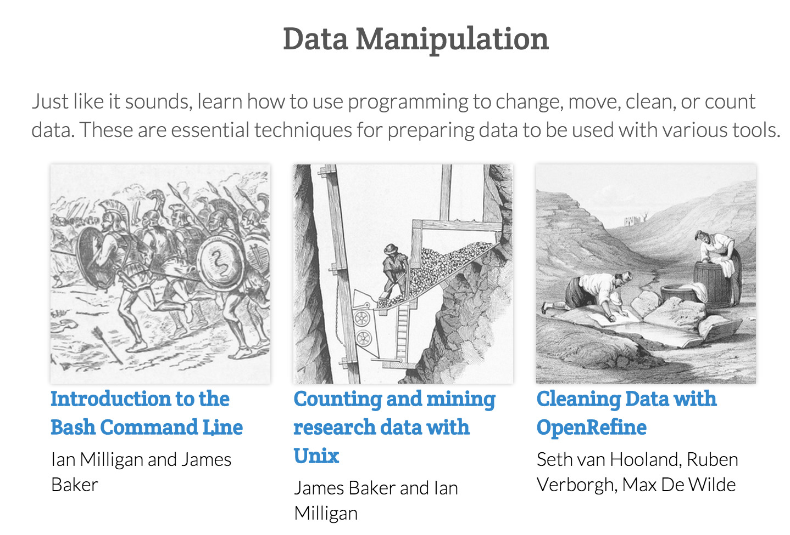

# Emerging Topics and Approaches to Scholarship in the Digital Humanities

#### University of Pittsburgh Johnstown Day of Digital Humanities

## Projects

- [Six degrees of francis bacon](http://www.6dfb.org/)
  
  - 
  
- [Topics in PMLA](http://agoldst.github.io/dfr-browser/demo/)
  
  - 
  
  ​

## Infrastructures

- [Scalar](http://scalar.usc.edu/features/flexible-structure/)
  - [Performing Archive: Curtis + “the vanishing race”](http://scalar.usc.edu/works/performingarchive/index)
- [Github](https://github.com/mcburton/)
  - [Searching for “digital humanities”](https://github.com/search?utf8=%E2%9C%93&q=digital+humanities)
- [Jupyter Notebooks](http://jupyter.org)
  - [literate programming](https://en.wikipedia.org/wiki/Literate_programming) -> [literate computing](http://blog.fperez.org/2013/04/literate-computing-and-computational.html)
  - [Demo](https://try.jupyter.org/)

## Pedagogy

- [Programming historian](http://programminghistorian.org/)

- 

- [Computational Media](http://www.annettevee.com/2015fall_computationalmedia/)
  - [How to make a Twitter bot](https://emerging.commons.gc.cuny.edu/2013/10/making-twitter-bot-python-tutorial/)

## Communication

- Social Media
  - 
- - [DHNow](http://digitalhumanitiesnow.org/subscribed-feeds/)
    - 
  - [DH Twitter](http://www.martingrandjean.ch/digital-humanities-on-twitter/)
    - 
- Questions:
  - How have you disseminated your work, especially outside of traditional channels (conference, journal, book)?
  - Anyone have a blog? Twitter?